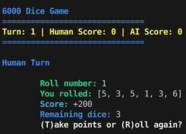
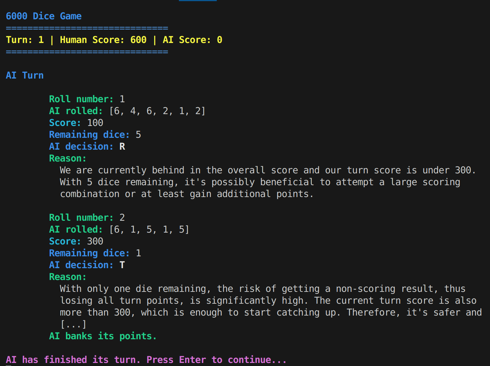

# 🎲 6000 Dice Game (Rust)

A simple CLI dice game where a human competes against an AI to reach 6000 points.

## ✨ Features

- Roll 6 dice and collect points based on combinations
- Human vs AI
- The AI decision-making is powered by **OpenAI's GPT-4** via API

## 🧠 Rules Summary

- **Straight (1–6):** 2000 points
- **Three pairs:** 1500 points
- **Six of a kind:** value × 1000
- **Three 1s:** 1000 points
- **Three of a kind (2–6):** value × 100
- **Each 1:** 100 points
- **Each 5:** 50 points
- **No points:** Lose your turn's accumulated score

## 📸 Screenshots

Below are some screenshots of the game in action:




## 🔧 Setup

Make sure you have a valid OpenAI API key:

```bash
export OPENAI_API_KEY=your_key_here
```

## 🚀 Start game

```bash
cargo run start
```bash
