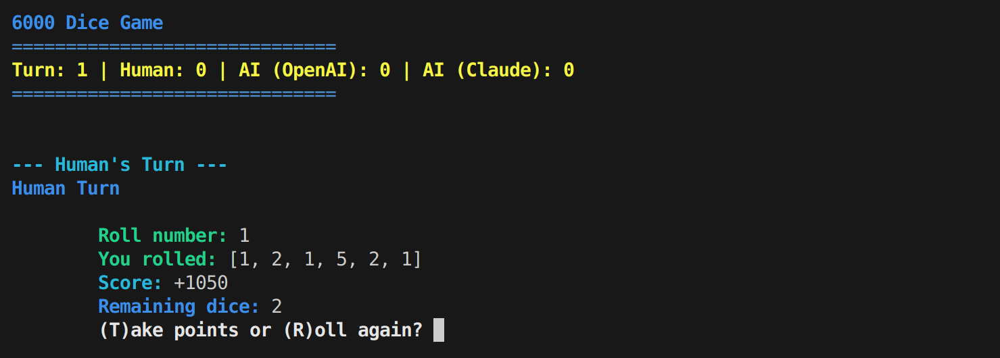
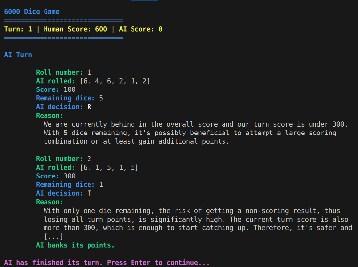
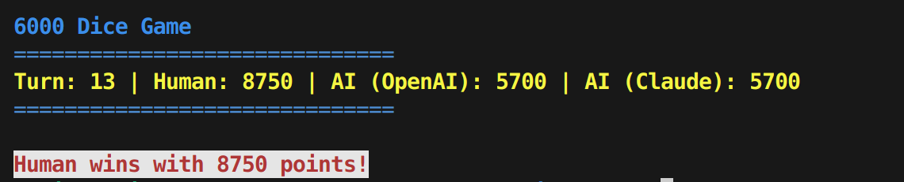

# 🎲 6000 Dice Game

A simple CLI dice game where a human competes against AI to reach 6000 points.

## ✨ Features

- Roll 6 dice and collect points based on combinations
- Human vs tho AIs
- Play against two powerful AIs: OpenAI GPT-4 and Claude 4 by Anthropic

## 🧠 Rules Summary

- **Straight (1–6):** 2000 points
- **Three pairs:** 1500 points
- **Six of a kind:** value × 1000
- **Three 1s:** 1000 points
- **Three of a kind (2–6):** value × 100
- **Each 1:** 100 points
- **Each 5:** 50 points
- **No points:** Lose your turn's accumulated score

## 📸 Screenshots

Below are some screenshots of the game in action:





## 🔧 Setup

You must provide at least one valid API key to enable AI gameplay.

To use OpenAI's GPT-4, set your API key:

```bash
export OPENAI_API_KEY=your_key_here
```

To use Anthropic Claude 4, set your API key:

```bash
export ANTHROPIC_API_KEY=your_key_here
```

You can configure one or both. The game will use the corresponding AI(s) based on the keys provided.

## 🚀 Start game

```bash
cargo run play
```
